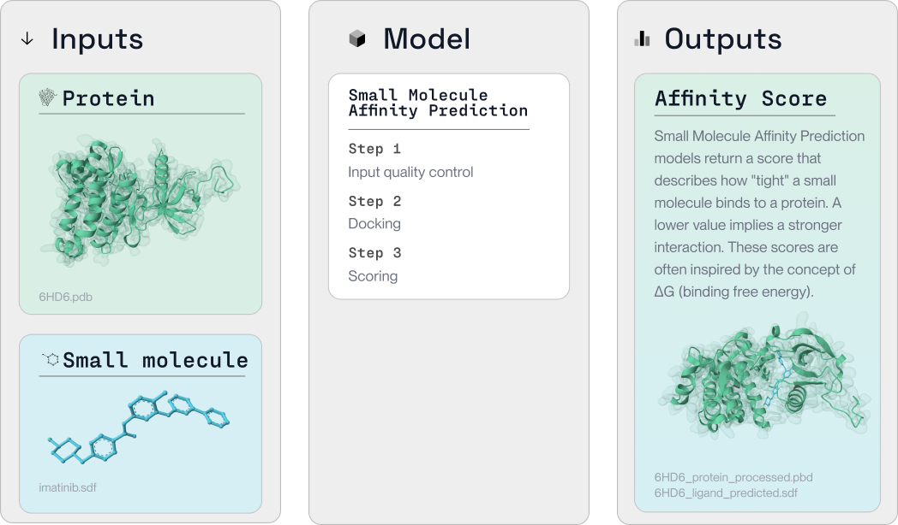

## What is small molecule binding affinity?
Small molecule binding affinity describes the strength of the interaction between a small molecule and a target, often a protein. The binding affinity of a small molecule and a protein can be described with three related metrics, ΔG (binding free energy), Kd (dissociation constant), or the IC50 (half-maximal inhibitory concentration).

Generally, ΔG is considered the most generalisable metric to describe binding affinity, while the IC50 is an easy to measure, but highly context dependent metric. For each of these three metrics, a lower value implies a "tighter" interaction between the small molecule and target protein. 

## Predicting Binding Affinity

Machine Learning models can be used to predict the binding affinity of a small molecule and protein. At LabDAO we are focused on curating and maintaining the most effective tools to accelerate the drug discovery process. You can browse the available [tools](https://docs.labdao.xyz/affinity-prediction/tools) and run a [tutorial](https://docs.labdao.xyz/affinity-prediction/installation_tutorial) to get started.
