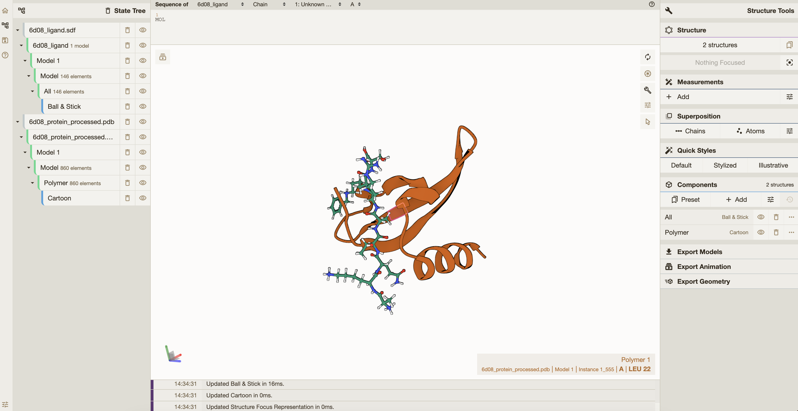

## 1. Install Plex
In order to run LabDAO's tools you need to install the Plex client. This is a piece of code that will allow you to run tools, such as the binding affinity prediction tool, by requesting compute-time from members of the LabDAO network.

### Open your terminal
To install Plex, you need to open your terminal. You can learn more about the absolute basics in [youtube tutorials](https://youtu.be/aKRYQsKR46I?t=36), or work through a complete introduction with ressources from the [software carpentry](https://swcarpentry.github.io/shell-novice/01-intro/index.html).

### Type in the command
Once you have your terminal open, you need to type in a command to install Plex. Below is a command you can copy (*CMD+C*) and paste (*CMD+V*) into your terminal. After you have pasted the command into the terminal, press **Enter**:

```
curl -sL https://raw.githubusercontent.com/labdao/ganglia/main/plex/install.sh -O
```
Once you have downloaded the client, you can install it with:
```
source install.sh
```

It is expected that after pressing **Enter** on your keyboard, there will be a lot of information about the download, and installation of the tool. If the installation was successful, you will see a large LabDAO logo appear on your screen. 

### Enter your password during the installation
During the installation, you will be asked for your password. This is the password you use to log in to your computer. When you type your password, you won't see any characters appear on the screen, but don't worry, the computer is still registering what you're typing.

### Give Plex the right permissions
After the installation is complete, you need to give the Plex client the permissions it needs to run. To do this, type the following command into your terminal and press **Enter**:

```
chmod +x ./plex
```

It is expected that after pressing **Enter** on your keyboard, there won't be a notifcation in your terminal (aka *nothing* will happen).

## 2. Add an API Key
Next, you need to add an API key to use Plex. An API key is a special code that allows the tool to communicate with other programs on the internet.

### Get your API token
To get your API token, you need to contact us. You can do this by sending an [email](mailto:stewards@labdao.com). We will give you an API token to use.

### Add your API token
Once you have your API token, you need to add it to the tool. To do this, type the following command into your terminal:

```
export WEB3STORAGE_TOKEN=<your token here>
```

Make sure to replace ```<your token here>``` with the actual API token you received. There should be no ```<>``` symbols in the token. It is expected that after pressing **Enter** on your keyboard, there won't be a notifcation in your terminal (aka *nothing will happen*).

## 3. Run an example
Now we will run a first tool using Plex.

### Submit a job
You can run the following command inside the newly-created plex folder to run a container:

```
./plex -app equibind -input-dir ./testdata -gpu false
```
Note: you might run into issues with your firewall when running the tool for the first time. On your Mac, you can access your settings via ```System Preferences > Security & Privacy```.

### Visualise the job results
Once the job has completed, you will be shown a file path that shows you the output directory, for example: ```/Users/your-name/plex/bb24bb4d-647f-487e-a1b6-16646a227318```.

You can inspect the results interactively with a viewer, such as [molstar](https://molstar.org/viewer/) by dragging and dropping your result file into the app.


