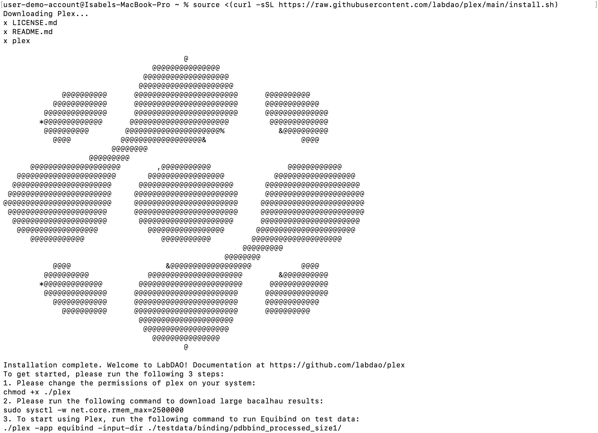

This tutorial will guide you through the steps required to set up PLEX, so you can easily run BioML tools from your computer's command line.

:::note

**What is PLEX?**

PLEX is a piece of software that allows you to run computational biology tools using simple commands from your computer. 

PLEX manages all the required dependencies and installations, to make the tools as easy to run as possible. 

When you run a tool, PLEX requests compute-time from members of the LabDAO network, so you don’t have to worry about hardware requirements or setting up the neccesary compute infrastructure.

:::

Let's get started!

---

**Time needed:**
- 3 minutes

**Requirements:**

- No previous technical experience - we’ll walk through each step.

---

## Install PLEX

### 1. Open your terminal
To install PLEX, first open up the Terminal application.

- On Mac: Go to “Spotlight Search” in the top right hand corner of your screen (it’s the magnifying glass icon). Type “terminal” and select the first option.
- On Windows: To use on Windows, please send us an [email](mailto:stewards@labdao.com) and we'll get you set up.

### 2. Type in the installation commands
Once you have your terminal open, you can download PLEX by copy and pasting this command into your terminal:

```
source <(curl -sSL https://raw.githubusercontent.com/labdao/plex/main/install.sh)
```

After you have pasted the command into the terminal, press **Enter** on your keyboard to download and install PLEX.

If the installation is successful, you will see a large LabDAO logo appear on your screen, and a confirmation that the Installation is complete. It should look something like this:



### 3. Give PLEX the right permissions
After the installation is complete, you need to give PLEX the permissions it needs to run. To do this, copy and paste the following command into your terminal and press **Enter**:

```
chmod +x ./plex
```

It is expected that after pressing **Enter**, **there will NOT be a notification** in your terminal (i.e. *nothing will happen*).

**You're now ready to run a tool!**

## Next steps: Run a tool to check PLEX is working as expected

* Try this quick-run [small molecule binding tool](../small-molecule-binding/run-an-example.md). 
* It's a fast algorithm, so you can run a job and visualise results in 3-5 minutes.

:::tip

If you want to learn more about the basics of using a terminal, check out these [youtube tutorials](https://youtu.be/aKRYQsKR46I?t=36). 

You can also work through a complete introduction with these excellent resources from [Software Carpentry](https://swcarpentry.github.io/shell-novice/01-intro/index.html).

:::

