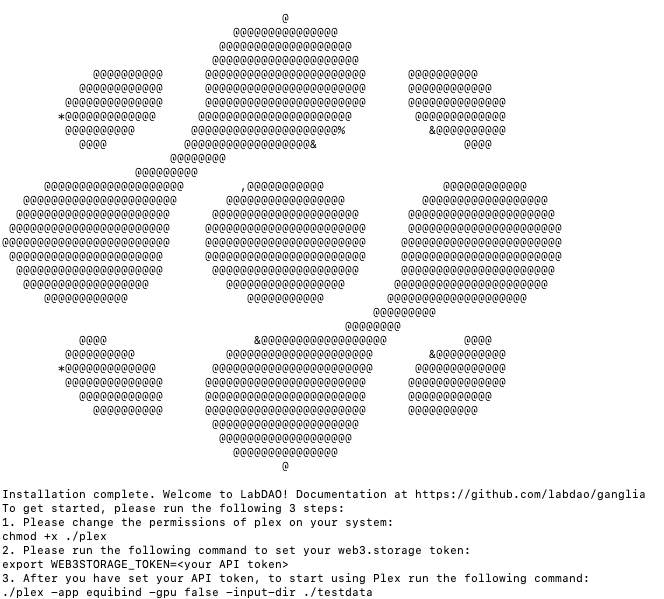

This tutorial will guide you through the steps required to set up Plex, the LabDAO client, so you can run BioML tools easily, directly from your computer.

:::note

**What is Plex?**

Plex is a piece of software that will allow you to run tools, such as the *binding affinity prediction tool*, by using simple commands from your computer. 

Plex manages all the required dependencies and installations, to make the tools as easy to run as possible. 

When you run a tool, Plex requests compute-time from members of the LabDAO network, so you don’t have to worry about hardware requirements or setting up the neccesary compute infrastructure.

:::

---

**Time needed:**
- 5 minutes

**Requirements:**

- No previous technical experience - we’ll walk through each step.
- An API token: Request an API token [here](https://whe68a12b61.typeform.com/to/PpbO2HYf). We'll email you one automatically, so you should get one in a few minutes. 

*If you haven’t used an API key before, don’t worry. It’s just a string of characters that acts like a password. Once you've obtained an API key, you can simply copy and paste it - the tutorial shows you how.*

---

## 1. Install Plex

### (i) Open your terminal
To install Plex, first open up the Terminal application. The Terminal is a text-based method of using your computer.

- On Mac: Go to “Spotlight Search” in the top right hand corner of your screen (it’s the magnifying glass icon). Type “terminal” and select the first option.
- On Windows: To use on Windows, please send us [email](mailto:stewards@labdao.com) and we'll get you set up.

:::info

If you want to learn more about the basics of using a terminal, check out these [youtube tutorials](https://youtu.be/aKRYQsKR46I?t=36). 

You can also work through a complete introduction with these excellent resources from [Software Carpentry](https://swcarpentry.github.io/shell-novice/01-intro/index.html).

:::


### (ii) Type in the installation commands
Once you have your terminal open, you can download Plex by copy (*CMD+C*) and pasting (*CMD+V*) this command into your terminal:

```
source <(curl -sSL https://raw.githubusercontent.com/labdao/plex/main/install.sh)
```

After you have pasted the command into the terminal, press **Enter** on your keyboard to download and install Plex. 

:::tip

A lot of information will print to the screen as the tool is installing. As a first time user, you can ignore this.

:::

### (iii) Enter your password during the installation
During the installation, you will be asked for your password. This is the password you use to log in to your computer. Type your password and press **Enter.**

:::tip

When you type your password, you won't see any characters appear on the screen - but don't worry, the computer is still registering what you're typing.

:::

If the installation is successful, you will see a large LabDAO logo appear on your screen, and a confirmation that the Installation is complete. It should look something like this:



### (iv) Give Plex the right permissions
After the installation is complete, you need to give Plex the permissions it needs to run. To do this, copy and paste the following command into your terminal and press **Enter**:

```
chmod +x ./plex
```

It is expected that after pressing **Enter**, **there will NOT be a notification** in your terminal (i.e. *nothing will happen*).

## 2. Add an API token
Next, you need to add an API key to use Plex. An API key is a special code that allows the tool to communicate with other programs on the internet.

### (i) Get your API token
Request an API token [here](https://whe68a12b61.typeform.com/to/PpbO2HYf). We'll email you one automatically, so you should get it in a few minutes.

### (ii) Add your API token
Once you have your API token, you need to add it to the tool. To do this, type the following command into your terminal and press **Enter**:

```
export WEB3STORAGE_TOKEN=<your token here>
```

:::tip

Make sure to replace ```<your token here>``` with the actual API token you received. There should be no ```<>``` symbols in the token - e.g.: ```export WEB3STORAGE_TOKEN=abcdefghijklmnopqrstuvwxyz123456789```

:::

It is expected that after pressing **Enter**, **there will NOT be a notification** in your terminal (i.e. *nothing will happen*).

**You're now ready to run a tool!**

## Next steps: Run a tool to check Plex is working as expected

* Try this quick-run [small molecule docking tool](https://docs.labdao.xyz/affinity-prediction/run_an_example). 
* It's a fast algorithm, so you can run a job and visualise results in 3-5 minutes.

