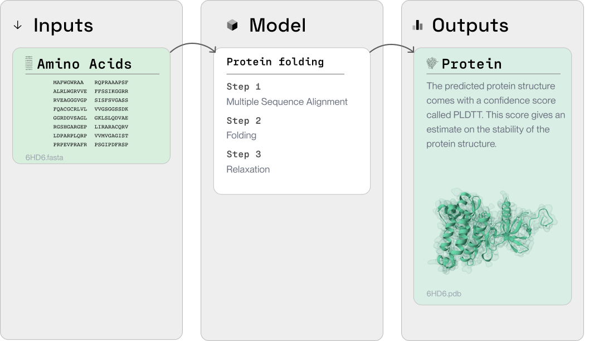

## What is Protein Folding?
Protein folding is a process, whereby a protein's chain of amino acids is "folded" into a 3D structure.

The structure of a protein affects its function. The structure determines which channels, receptors, and binding sites are exposed - thus affecting how the protein interacts with other proteins and molecules. 

Predicting the 3D structure for a given protein is an important task in modern drug discovery. It helps scientists to:

* Understand a particular protein, which may have been identified as a possible drug target.
* Explore potential medicines that might bind to the protein (e.g. by performing [small molecule binding](https://docs.labdao.xyz/small-molecule-binding/overview) experiments).

## What is the Protein Folding Toolset?

We have put together a **curated toolset** for protein folding.

In the Protein Folding Toolset, you can find:

* [An overview of the tools we provide for protein folding](/protein-folding/tools)
* [A step-by-step example of running the tool and visualizing the results](/protein-folding/run-an-example)

Here is an overview of the package:

