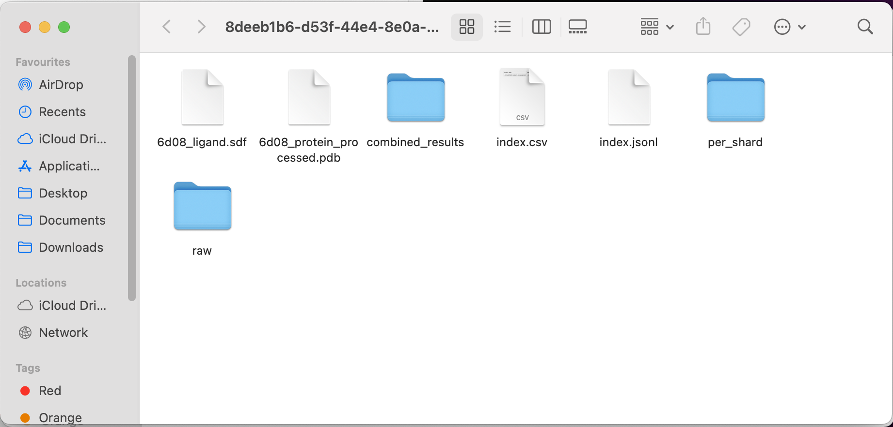

:::note

This tutorial is a step-by-step guide to running a small molecule binding tool for the first time. If you are familiar with using the command line and have analysed biological data before, you may wish to use the [quickstart guide](https://docs.labdao.xyz/small-molecule-binding/quickstart).

:::

This tutorial will guide you through the steps required to run a small molecule binding tool directly from your computer.

By the end of this tutorial, you will have:

* Run a docking tool (Equibind) on our provided test data, which include a protein file and a small molecule file
* Visualized the results

Let’s get started!

---

**Time needed:**
- 5 minutes

**Requirements:**

- Install PLEX ([installation guide here](https://docs.labdao.xyz/install-plex))
- An API token: Request an API token [here](https://whe68a12b61.typeform.com/to/PpbO2HYf). We'll email you one automatically, so you should get one in a few minutes.
- No previous technical experience - we’ll walk through each step.

*If you haven’t used an API key before, don’t worry. It’s just a string of characters that acts like a password. Once you've obtained an API key, you can simply copy and paste it - the tutorial shows you how.*

---

In this tutorial we will run a small molecule binding task using PLEX.

So that you can get started straight away, we included an example protein file and small molecule file when you installed PLEX.

After [installing PLEX](https://docs.labdao.xyz/install-plex), follow the steps below:

### 1. Submit a job

Copy and paste the following command to run the tool using our provided test data and press **Enter**:

```
./plex -app equibind -input-dir ./testdata -gpu false
```

You should see the following:


:::tip

You might get a pop-up asking *"Do you want the application “plex” to accept incoming network connections?”*. Click ***“Allow”***.

If you need to, you can turn off your firewall. To do this on your Mac, go to settings via `System Preferences > Security & Privacy`. Then go to the Firewall tab, and click the padlock icon at the bottom of the window to make changes. Click the “Turn off Firewall” button and try running the tool again.

:::

### 2. Get the results

Once the job is complete and the results have downloaded, you will see the file path where your results can be found. It will look something like this: 


To open the folder where your results are stored, type ```open``` into your command line, followed by the file path you were given as an output e.g. ```open /Users/user-demo-account/plex/8deeb1b6-d53f-44e4-8e0a-6d7be6f1c43d```.  Press **Enter**

This will show your results in Finder.



### 3. Visualize the job results

To visualize the results, we are going to use Molstar.

In your results Finder window, click the “combined_results” folder, then the “outputs” folder.

(In our example, the file path would be: ```/Users/user-demo-account/plex/8deeb1b6-d53f-44e4-8e0a-6d7be6f1c43d/combined_results/outputs)```

You should see:


To inspect the results interactively with a viewer, open [the Molstar visualizer in your web browser.](https://molstar.org/viewer/)

Drag and drop **both the files** into the central blank frame in Molstar to see the result as per the gif below:


Here is a close up what the result looks like in Molstar:


You can see how tightly the small molecule is predicted to bind to the protein. 

For more on how to use the Molstar viewer, check out [the Molstar documentation](https://molstar.org/viewer-docs/).

### Congratulations, you’ve downloaded PLEX and run a docking tool!

