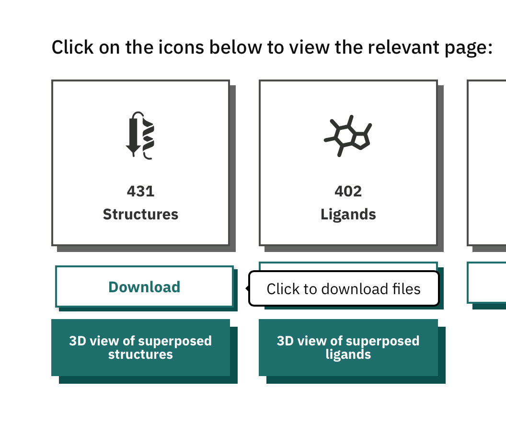
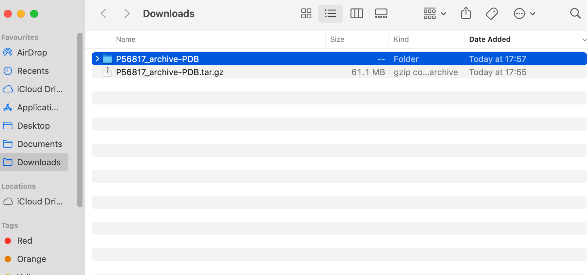
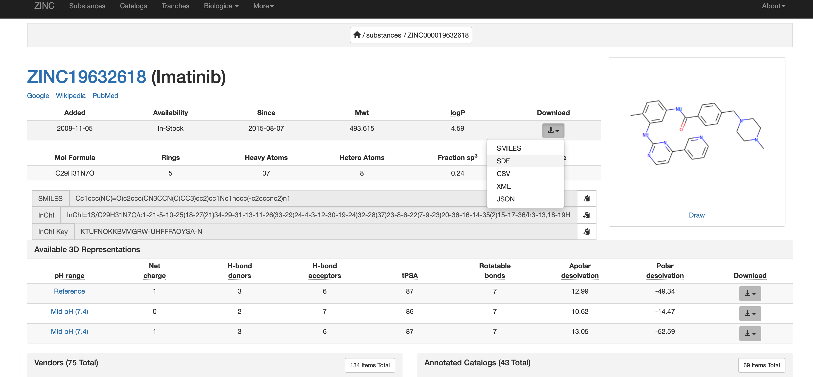
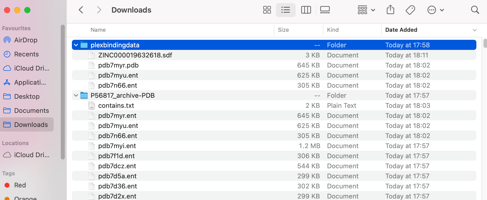
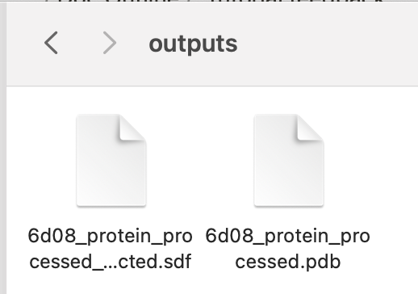

This tutorial will guide you through the steps required to run a small molecule binding tool using proteins and ligands of your choosing.

By the end of this tutorial, you will have:

* Run docking tools (Equibind and Diffdock) on your own data
* Visualized the results

Let’s get started!

---

**Time needed:**
- Less than 5 minutes

**Requirements:**

- Install PLEX ([installation guide here](../getting-started/install-plex.md))
- No previous technical experience - we’ll walk through each step.

---

Overview:

The steps to run a small molecule binding tool with PLEX on your own data are as follows:

1. Place the protein (.pdb) file and ligand (.sdf) file into a particular folder e.g. ```~/downloads/plexbindingdata```

2. Run the command, pointing to this folder as the input directory:

```
./plex -app equibind -input-dir ~/downloads/plexbindingdata
```

:::note

When you point PLEX to an input directory, PLEX automatically searches for files that are the correct file type for the input of the application. For small molecule binding, the input file types are .pdb (proteins) and .sdf(ligands).

It will run all combinations of files. So if you have 3 .pdb files and 3 .sdf files, it will run 9 combinations.
:::

# Step-by-step guide

## 1. Find and download your protein and ligand files

As an example, we want to explore the binding between Beta-secretase 1 (UniProt P56817) and Imatinib (ZINC19632618).

### (i) Get the protein files.

A good resource for protein structures is the [Protein Data Bank in Europe Knowledge Base (PDBe-KB)](https://www.ebi.ac.uk/pdbe/pdbe-kb/). You can search for the protein you want (in our example, search for "[P56817](https://www.ebi.ac.uk/pdbe/pdbe-kb/proteins/p56817)").

You will be taken to the page for this protein: 

Scroll down and click Download underneath "structures". 

Select "PDB file" under Structures from the option set. 

There are lots of structures for this protein, so we have downloaded a zip file (.tar.gz). Double click this to unzip the file. You should see a folder appear as shown below: 

### (ii) Get the small molecule / ligand files

A good resource for small molecules is the Zinc database. There are a few versions, but [Zinc20](https://zinc20.docking.org) is a recent option.

Search for the small molecule you want - go to "Substances" in the top bar, then search substances (Search: imatinib). You will see the results, and then click on the small molecule to see more. 

On the small molecule page, click download, and select SDF as the option: 

The file will now be in your downloads folder.

## 2. Move proteins and ligands to a target directory

Create a new folder in your download folder (or other location). You might want to call this something like "plexbindingdata", but choose whatever name makes sense.

Select the proteins you want to dock with the ligand, and copy these into the new folder.

Drag the .sdf file into the folder with the proteins.

It should look like this: 

## 3. Check file types are correct, and update if not

For the proteins, the file type needs to be .pdb. You can rename the .ent files to be .pdb files. 

The PLEX binding tool will run all on all .pdb files in a folder. Therefore, in the example shown below, only the top protein file (ending .pdb) will be analysed.

You should end up with something like this: 


## 4. Run PLEX for small molecule binding

Now we're ready to run PLEX for small molecule binding.

For Equibind, run the command below, changing the input directory to match where your data is stored.

```
./plex -app equibind -input-dir ~/downloads/plexbindingdata
```

For Diffdock, run the command below, changing the input directory to match where your data is stored:

```
./plex -app diffdock -input-dir ~/downloads/plexbindingdata
```

## 5. Visualize the results

To open the folder where your results are stored, type "```open ```" into your command line, followed by the file path you were given as an output e.g. ```open /Users/user-demo-account/plex/bd5c4751-0a7a-42bd-a92d-6a1a0758a6a3```.  Press **Enter**

This will show your results in Finder.


To visualize the results, we are going to use Molstar.

In your results Finder window, click the “combined_results” folder, then the “outputs” folder.

(In our example, the file path would be: ```/Users/user-demo-account/plex/8deeb1b6-d53f-44e4-8e0a-6d7be6f1c43d/combined_results/outputs```)

You should see an output for the protein and the ligand, for example:



To inspect the results interactively with a viewer, open [the Molstar visualizer in your web browser.](https://molstar.org/viewer/)

Drag and drop **both the protein and ligand files** into the central blank frame in Molstar to see the result as per the gif below:


Here is a close up what the result looks like in Molstar:


You can see how tightly the small molecule is predicted to bind to the protein. 

For more on how to use the Molstar viewer, check out [the Molstar documentation](https://molstar.org/viewer-docs/).

**Congratulations! You're able to run small molecule binding tools on your own data.**