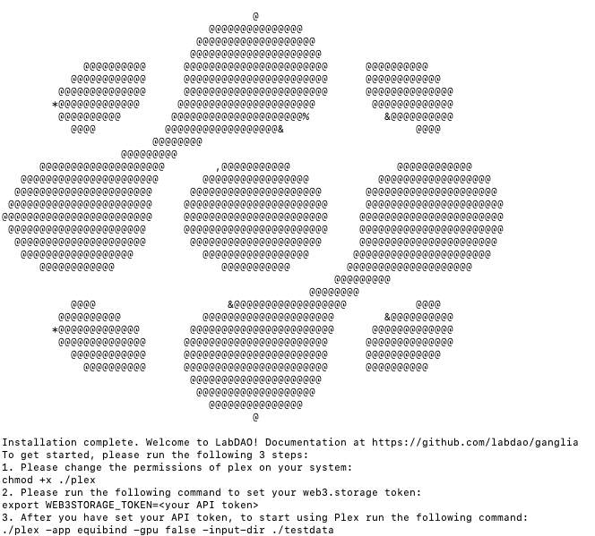
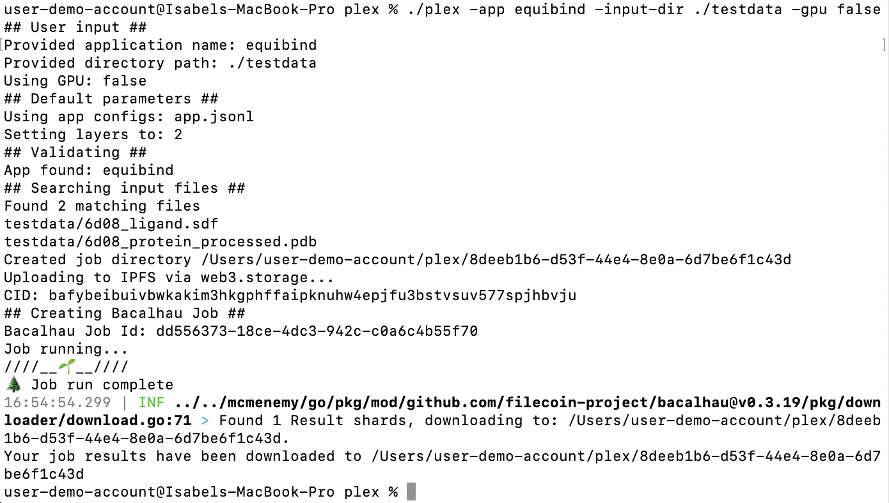
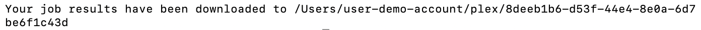
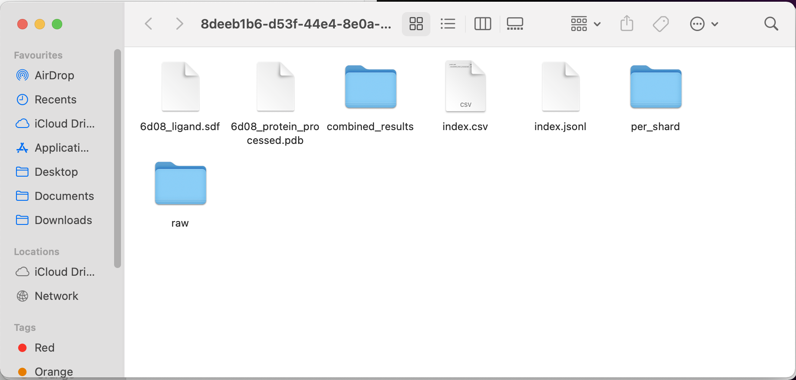
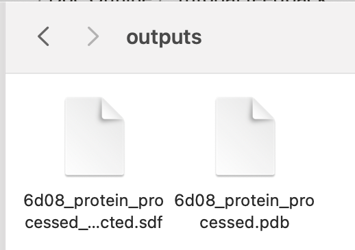
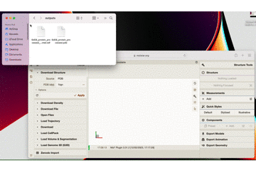

*Note: This tutorial is a step-by-step guide to installing Plex and running an affinity binding tool for the first time. If you are familiar with using the command line and have analysed biological data before, you may wish to use our [quickstart guide](https://docs.labdao.xyz/affinity-prediction/quickstart).*

This tutorial will guide you through the steps required to set up Plex, the LabDAO client, so you can **run affinity prediction tools** directly from your computer.

By the end of this tutorial, you will have:

* Installed Plex
* Run a docking tool (Equibind) on our provided test data, which includes a protein file and a small molecule file
* Visualized the results

Let’s get started!

## Requirements

- No previous technical experience - we’ll walk through each step.
- An API token

Please send us an [email](mailto:stewards@labdao.com) to get an API token. We’ll respond as quickly as we can. While you’re waiting, start the tutorial and download Plex (Step 1). If you haven’t used an API key before, don’t worry. It’s just a string of characters that acts like a password. You’ll just need to copy and paste it - the tutorial shows you how.

## 1. Install Plex
In order to run LabDAO's tools you need to install the LabDAO Plex client. 

### What is Plex
Plex is a piece of software that will allow you to run tools, such as the *binding affinity prediction tool*, by using simple commands from your computer. 

Plex manages all the required dependencies and installations, to make the tools as easy to run as possible. 

When you run a tool, Plex requests compute-time from members of the LabDAO network, so you don’t have to worry about hardware requirements or setting up the neccesary compute infrastructure.

### Open your terminal
To install Plex, first open up the Terminal application. The Terminal is a text-based method of using your computer.

- On Mac: Go to “Spotlight Search” in the top right hand corner of your screen (it’s the magnifying glass icon). Type “terminal” and select the first option.
- On Windows: To use on Windows, please send us [email](mailto:stewards@labdao.com) and we'll get you set up.

*If you want to learn more about the basics of using a terminal, check out these [youtube tutorials](https://youtu.be/aKRYQsKR46I?t=36), or work through a complete introduction with excellent resources from [Software Carpentry](https://swcarpentry.github.io/shell-novice/01-intro/index.html).*


### Type in the command
Once you have your terminal open, you can download Plex by copy (*CMD+C*) and pasting (*CMD+V*) this command into your terminal:

```
curl -sL https://raw.githubusercontent.com/labdao/ganglia/main/plex/install.sh -O
```

After you have pasted the command into the terminal, press **Enter** on your keyboard to download Plex.

Once you have downloaded Plex, you can install it by copy and pasting the command below:

```
source install.sh
```

Press **Enter.** There will be a lot of information about the download and installation of the tool. As a first time user, you can ignore this.

### Enter your password during the installation
During the installation, you will be asked for your password. This is the password you use to log in to your computer. Type your password and press **Enter.**

***NOTE: When you type your password, you won't see any characters appear on the screen - but don't worry, the computer is still registering what you're typing.***

If the installation is successful, you will see a large LabDAO logo appear on your screen, and a confirmation that the Installation is complete. It should look something like this:



### Give Plex the right permissions
After the installation is complete, you need to give Plex the permissions it needs to run. To do this, copy and paste the following command into your terminal and press **Enter**:

```
chmod +x ./plex
```

It is expected that after pressing **Enter**, there will **NOT be a notification** in your terminal (i.e. *nothing will happen*).

## 2. Add an API Key
Next, you need to add an API key to use Plex. An API key is a special code that allows the tool to communicate with other programs on the internet.

### Get your API token
To get your API token, you need to contact us. You can do this by sending an [email](mailto:stewards@labdao.com). We will give you an API token to use.

### Add your API token
Once you have your API token, you need to add it to the tool. To do this, type the following command into your terminal:

```
export WEB3STORAGE_TOKEN=<your token here>
```

**NOTE: Make sure to replace ```<your token here>``` with the actual API token you received. There should be no ```<>``` symbols in the token e.g. ```*export WEB3STORAGE_TOKEN=abcdefghijklmnopqrstuvwxyz123456789***```

It is expected that after pressing **Enter** on your keyboard, **there will NOT be a notification** in your terminal (i.e. *nothing will happen*).

## 3. Run an example
Now we will run a first tool using Plex.

So that you can get started straight away, we have included an example protein file and small molecule file in the download. 

Follow the steps below:

### Submit a job

Copy and paste the following command to run the tool using our provided test data:

```
./plex -app equibind -input-dir ./testdata -gpu false
```

You should see the following:



### Troubleshooting Job Submission
You might get a pop-up asking *"Do you want the application “plex” to accept incoming network connections?”*. Click *“Allow”*.

*If you need to, you can turn off your firewall. To do this on your Mac, go to settings via `System Preferences > Security & Privacy`. Then go to the Firewall tab, and click the padlock icon at the bottom of the window to make changes. Then click the “Turn off Firewall” button and try running the tool again.*

### Get the results

Once the job is complete and the results have downloaded, you will see the file path where your results can be found. It will look something like this: 



The view the results, open the folder where your results are stored. Type ```open``` into your command line, followed by the file path you were given as an output e.g. ```open /Users/user-demo-account/plex/8deeb1b6-d53f-44e4-8e0a-6d7be6f1c43d```

This will show your results in Finder.



### Visualize the job results

To visualize the results, we are going to use Molstar.

In your results Finder window, click the “combined_results” folder, then the “outputs” folder.

(In our example, the file path would be: ```/Users/user-demo-account/plex/8deeb1b6-d53f-44e4-8e0a-6d7be6f1c43d/combined_results/outputs)```

You should see:



To inspect the results interactively with a viewer, open [the Molstar visualizer in your web browser.](https://molstar.org/viewer/)

Drag and drop **both the files** into the central blank frame in Molstar to see the result as per the gif below:



Here is a close up what the result looks like in Molstar:


You can see how tightly the small molecule is predicted to bind to the protein. For more on how to use the Molstar viewer, check out [the Molstar documentation](https://molstar.org/viewer-docs/).

Congratulations, you’ve completed this tutorial! 